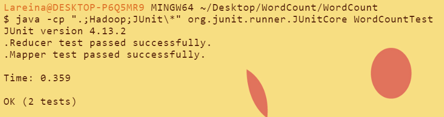
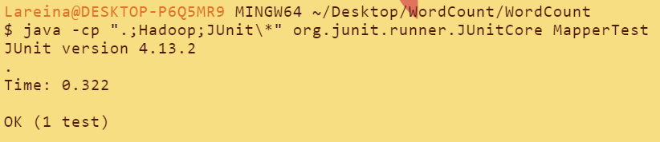
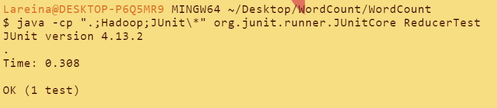

WordCount App with JUnit Tests on openJDK 8, Hadoop 3.3.5 and JUnit4

To run the project, you need to have hadoop environment

To add dependencies, the easiest way is to hold the project on IntelliJ IDEA

Select 'Project Structure'->'Dependencies'->'+'->'jars or directories', and add both /Hadoop and /Junit folder in it

To package the .jar file:
1. Select 'Project Structure'->'Artifacts'->'+'->'jar'->'from modules with dependencies'->'main project'->'WordCount'
        'Output Directories'->'WordCount/WordCount'->'OK'
2. Select 'Build'->'Build Artifacts'->'Build'

To run the .jar file: `java -jar WordCount.jar shakespeare.txt output`

  
  

WordCountTest is for black-box JUnit testing, and MapperTest and ReducerTest are for white-box JUnit testing

To run the test by command:
1. Set you Java path:
   `export JAVA_HOME=/path/to/jdk`
   `export PATH=$JAVA_HOME/bin:$PATH`
2. Compile the JUnit test files by:
   `javac -cp ".;Hadoop;JUnit/*" Testfile.java`
3. Run the JUnit test files by:
   `java -cp ".;Hadoop;JUnit\*" org.junit.runner.JUnitCore Testfile`
It will show: 

